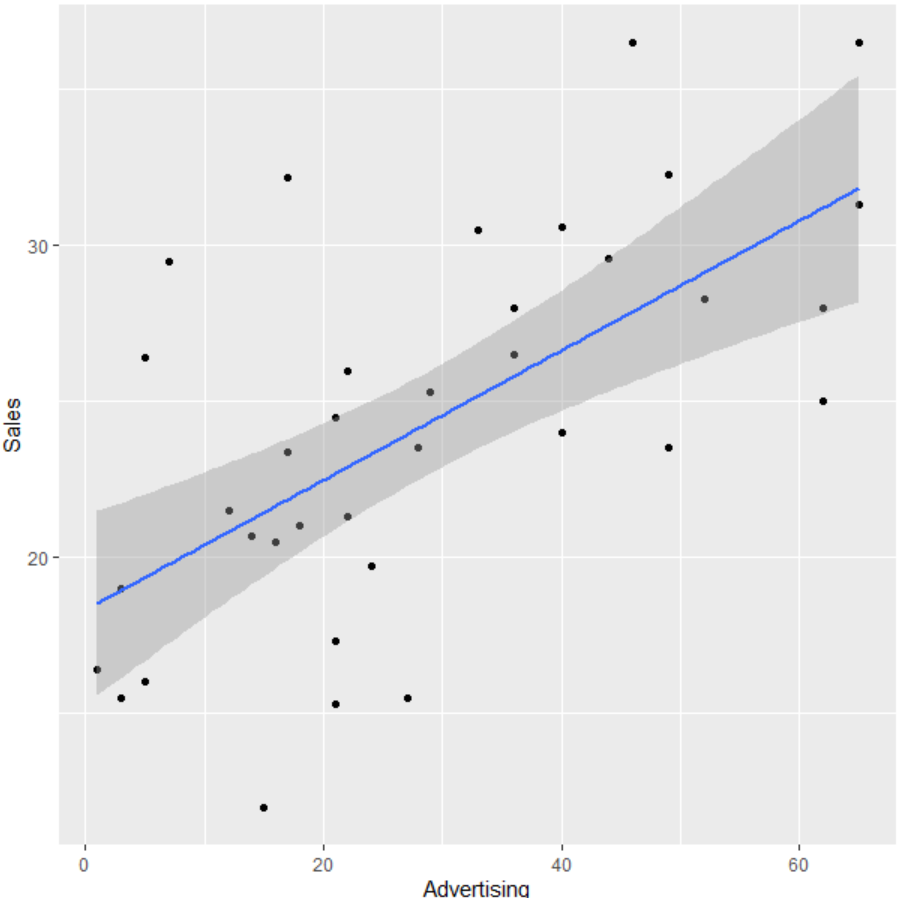
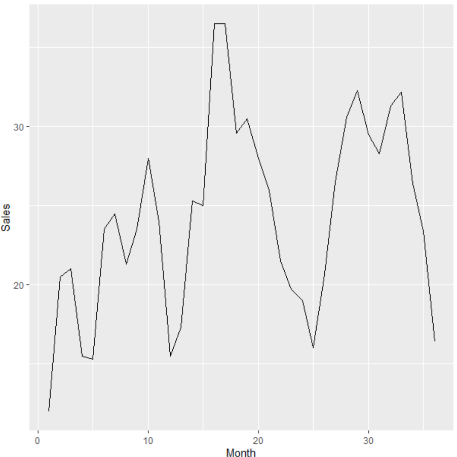
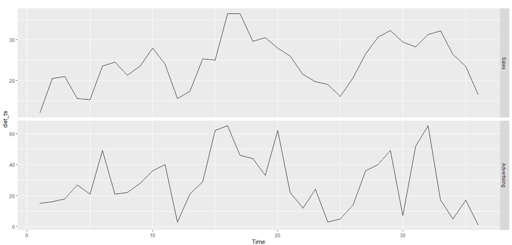
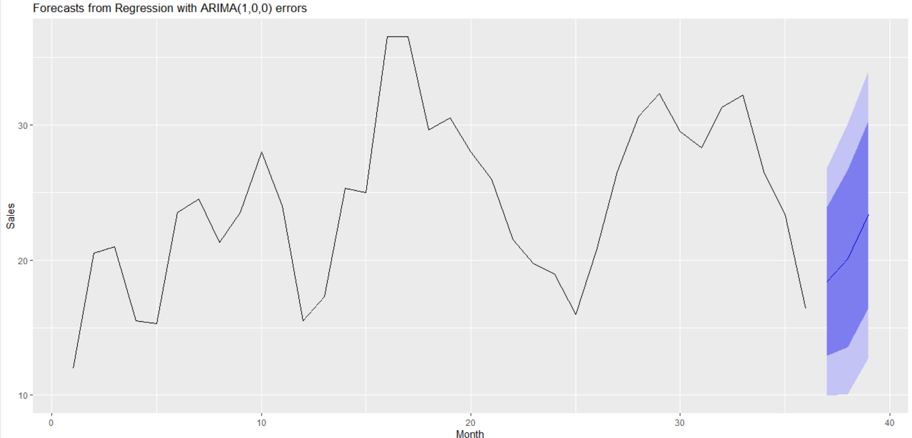
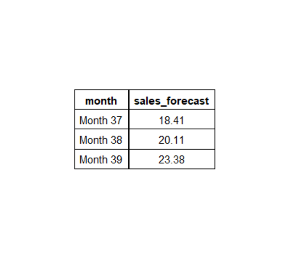

# Time-Series-Forecasting-for-Advertising

Sales forecasting using historical data is crucial for any business. Regression is particularly useful for creating forecasts, allowing you to predict numerical outcomes based on factors such as time. Dynamic Regression plays an important role, when we wish to incorporate additional independent variables in our forecast.

Unlike linear regression, dynamic regression uses an error term based on an Auto-Regressive Integrated Moving Average (ARIMA) process. ARIMA models are a forecasting method known for their accuracy when dealing with data influenced by multiple independent variables, such as advertising, which affects the dependent variable, like sales.

To forecast sales while considering advertising, I will use dynamic regression. The dataset, from Chapter 34 of Wayne L. Winston’s "Marketing Analytics: Data-Driven Techniques with Microsoft Excel," includes 36 months of sales data for a diet product.

The dataset contains three variables:

- Month
- Sales (USD thousands)
- Advertising Spend (USD thousands)

## EDA
run the describe() function

Sales are generally high when advertising spend is high

## ARIMA
time plot of both variables

## Forecast of Regression with ARIMA

## Projected Sales for subsequent quarters

